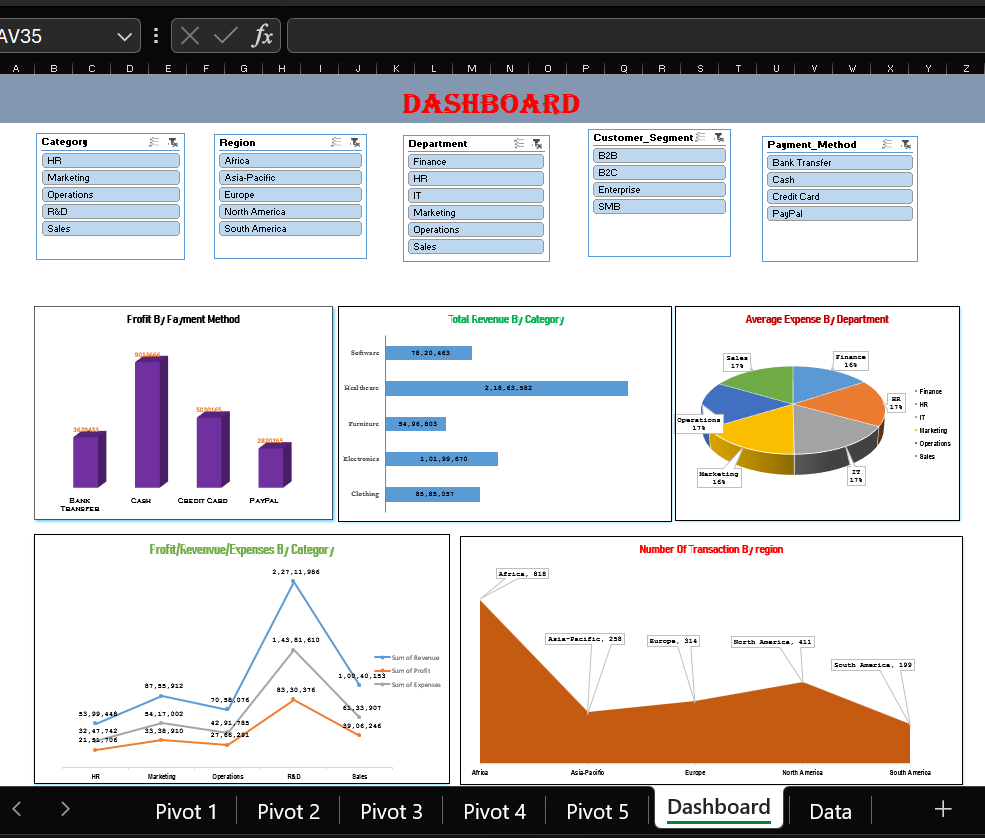

# Sales-Performance-Excel-Dashboard

# 📊 Sales Performance Analysis Dashboard (Microsoft Excel)

## 📌 Project Overview

This project presents an interactive **Sales Performance Dashboard** built using **Microsoft Excel**. The dashboard provides insights into sales performance across different regions, departments, customer segments, payment methods, and product categories.

The dashboard enables users to filter data dynamically using slicers and analyze key business metrics for informed decision-making.

---

## 🚀 Tools Used

- Microsoft Excel
- Pivot Tables
- Pivot Charts
- Slicers
- Conditional Formatting
- Excel Formulas

---

## 📂 Dataset Features

The dataset contains the following columns:

- Transaction_ID
- Transaction_Date
- Revenue
- Expenses
- Profit
- Category
- Region
- Department
- Product_Line
- Customer_Segment
- Payment_Method
- Discount

---

## 📊 Dashboard KPIs

- Total Revenue
- Total Expenses
- Total Profit
- Number of Transactions
- Average Expenses
- Profit Analysis

---

## 📈 Dashboard Visualizations

- Profit by Payment Method
- Total Revenue by Category
- Average Expenses by Department
- Profit, Revenue & Expenses by Category
- Number of Transactions by Region

---

## 🎛 Interactive Filters

- Category
- Region
- Department
- Customer Segment
- Payment Method

---

## 💡 Business Insights

- Identify top-performing categories.
- Compare revenue across different regions.
- Analyze department-wise expenses.
- Understand customer segment distribution.
- Compare payment methods based on generated profit.
- Monitor transaction distribution across regions.

---

## 📷 Dashboard Preview

---

## 🎯 Skills Demonstrated

- Data Cleaning
- Data Analysis
- Dashboard Design
- Business Intelligence
- Pivot Tables
- Pivot Charts
- Interactive Slicers
- Data Visualization

---

## 👨‍💻 Author

BhagyaRaj

LinkedIn:
www.linkedin.com/in/biradar-bhagyaraj

